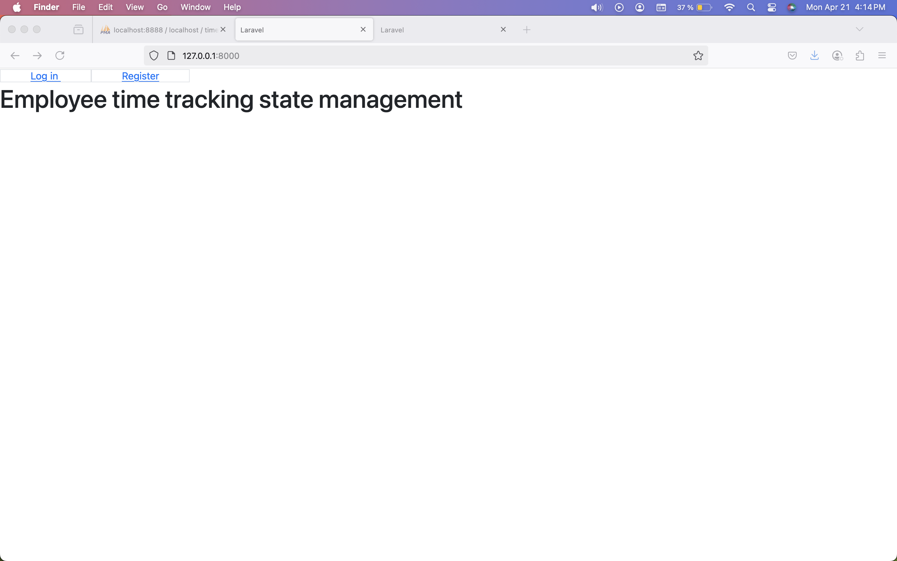
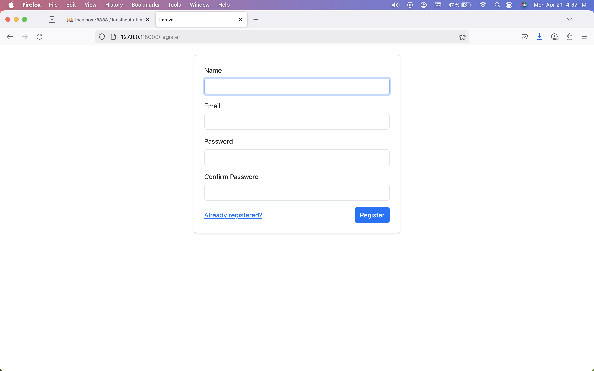
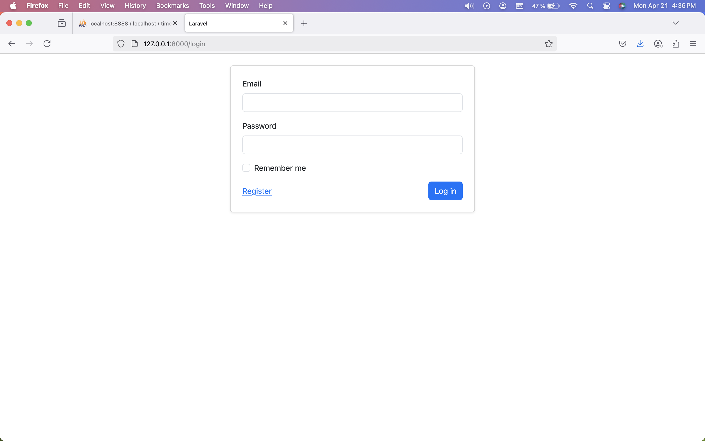
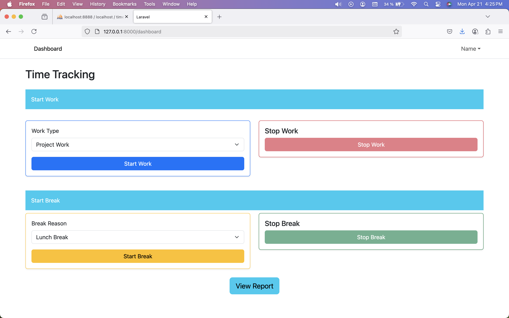
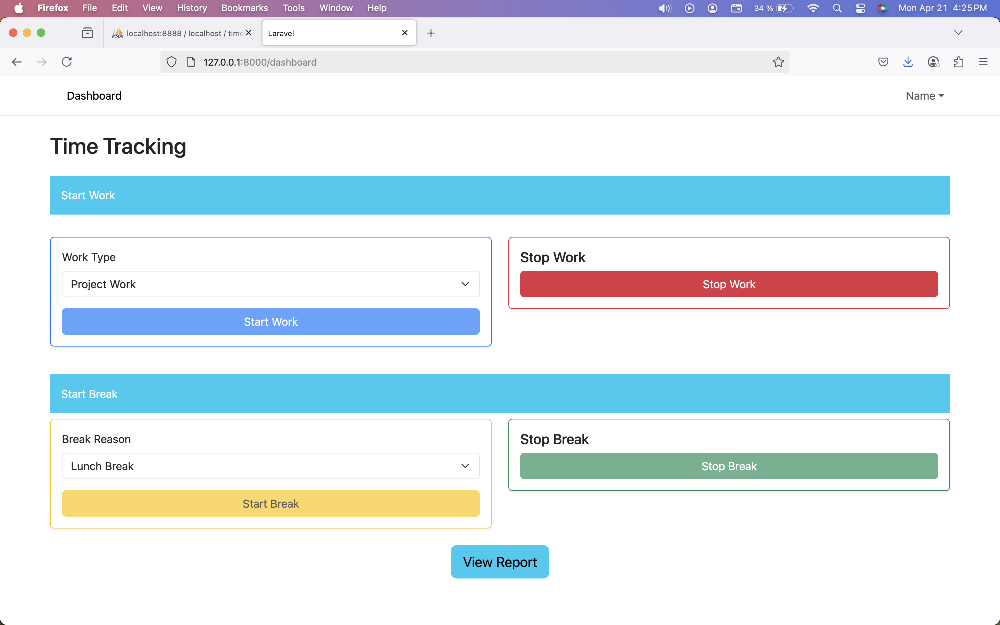
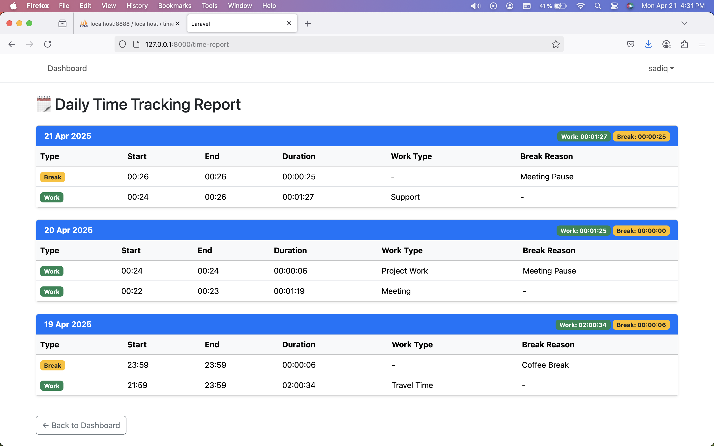

# Employees Time Tracking
A web-based time tracking application built to help employees record their working and break times easily. The system provides a clear, tabular overview of recorded times per employee and a report view to display aggregated daily totals work and break time with reason.

## 📦 Features

- ✅ Start Work / Stop Work time tracking
- ✅ Start Break / Stop Break functionality
- ✅ Dynamic UI controls (only relevant buttons enabled based on current state)
- ✅ Real-time AJAX form handling 
- ✅ Form button state persistence on page refresh (based on database state)
- ✅ Report section displaying total Work and Break times in `HH:MM:SS` format
- ✅ Clean code structure using Laravel Repository Pattern


---

## 🛠️ Installation

1. **Clone the Repository**
   ```bash
    git clone https://github.com/sadiqnoorw/employee_time_tracking.git
    cd TimeTracking_laravel
    ```

2. **Install Composer Dependencies**
    ```bash
    composer install
    ```


3. **Copy .env and Set Up Environment**
    ```bash
    cp .env.example .env
    php artisan key:generate
    ```


4. **Set Database Configuration Update your .env file with correct database credentials:**
    ```bash
    DB_CONNECTION=mysql
    DB_HOST=127.0.0.1
    DB_PORT=3306
    DB_DATABASE=your_database
    DB_USERNAME=your_username
    DB_PASSWORD=your_password
    ```


5. **Run Migrations**
    ```bash
    php artisan migrate
    ```


6. **(Optional) Seed Initial Data**
    ```bash
    php artisan db:seed
    ```


7. **Run the Application**
    ```bash
    php artisan serve
    ```

## 🖥️  Usage

Start Work → enables Stop Work, disables all other forms.

Start Break → enables Stop Break, disables all other forms.

Stop Work / Stop Break → disables the respective stop buttons and re-enables all start buttons.

The UI form state is maintained on page refresh using server-side checks based on active work or break status.

Reports section shows total time worked and break durations in HH:MM:SS format for the current user.
    

# 📖 Time Tracking System Flow

Below is the complete user journey explained with screenshots.

## 🏠 1. Landing Page
When a user visits the system, they’re welcomed by the landing page.




## 📝 2. Register
If the user doesn’t have an account, they can register by filling out the registration form.




## 🔑 3. Log In
After successful registration, the user can log in using their credentials.




## 📊 4. Dashboard (Before Starting Work)
Upon logging in, the user is redirected to the dashboard. Here, no work session has started yet.




## 🟢 5. Start Work
The user clicks on Start Work to begin their working session.




## 📑 6. View Report
At any time, the user can go to the Reports page to view a summary of their daily working hours and breaks.




